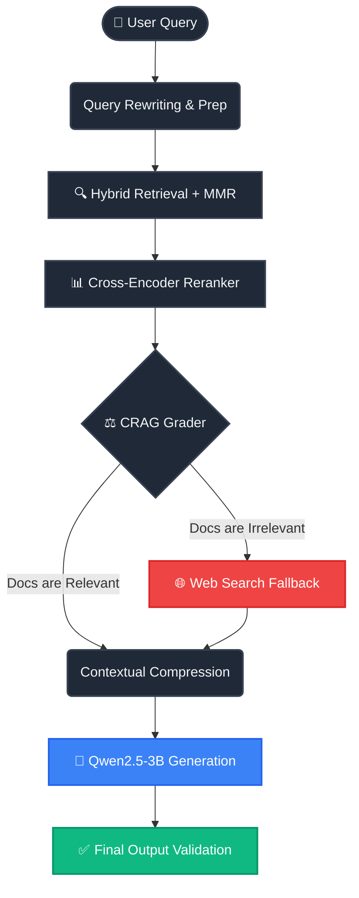

<div align="center">

# ⚕️ MyMED

**Next-Generation Medical RAG Engine for Hallucination-Free Clinical AI**

[](https://www.python.org/downloads/release/python-3100/)
[](https://fastapi.tiangolo.com/)
[](https://qdrant.tech/)
[](https://langchain.com/)
[](https://opensource.org/licenses/MIT)

MyMED is an advanced **Retrieval-Augmented Generation (RAG)** pipeline purpose-built for the medical domain. It fuses **Corrective RAG (CRAG)**, **hybrid retrieval**, and **contextual compression** to deliver factually grounded, verifiable answers to complex clinical questions.

[Features](#-key-features) • [Architecture](#-architecture) • [Getting Started](#-getting-started) • [API](#%EF%B8%8F-api-usage) • [Contributing](#-contributing)

</div>

---

## 💡 Why MyMED?

> [!CAUTION]
> Traditional Large Language Models (LLMs) are prone to hallucinations, making them dangerous for clinical decision-making without strict boundaries.

**MyMED solves this by prioritizing factuality over fluency.** 
When a user asks a medical question, MyMED doesn't just guess. It retrieves domain-specific context from your trusted documents (PDFs, PPTXs, clinical notes), dynamically **grades** the retrieved context, and falls back to web searches if your internal documents don't have the answer. 

---

## ✨ Key Features

* **🧠 Corrective RAG (CRAG) Grader Core**  
  Every retrieved document is dynamically evaluated by an LLM grader. If the context is poor, the system autonomously triggers query rewriting or safe web-search fallbacks (DuckDuckGo).
* **🔍 Hybrid MMR Search Engine**  
  Pairs dense embeddings (`BAAI/bge-small-en-v1.5`) with sparse BM25 retrieval, followed by Maximal Marginal Relevance (MMR) optimization for maximum context diversity.
* **⚡ Deep Post-Retrieval Compression**  
  Cross-encoder reranking (`ms-marco-MiniLM`) and contextual document compression ensure only the most precise, needle-in-the-haystack information is passed to the LLM.
* **🔒 Enterprise Multi-Tenancy**  
  Built-in support for `user_id` and `session_id` isolation, ensuring strict access control across uploaded clinical texts and querying sessions.
* **🚀 High-Performance FastAPI Backend**  
  Fully asynchronous, horizontally scalable architecture.

---

## 🏗 Architecture

To prevent overwhelming the LLM context window with irrelevant medical noise, MyMED operates as a highly orchestrated, multi-stage pipeline:

<details>
<summary><b>Click to expand the Architecture Diagram</b></summary>


</details>

---

## 🚀 Getting Started

> [!IMPORTANT]  
> MyMED utilizes heavy embedding and reranking models locally. We strongly recommend running this on a machine with a discrete GPU (NVIDIA CUDA) for optimal latency.

### 1. Requirements

*   **Docker & Docker Compose** (For scaling Qdrant Vector Store)
*   **Python 3.10+**

### 2. Infrastructure Setup
Spin up the local vector database instance using the provided compose file:
```bash
docker-compose up -d
```

### 3. Application Installation
```bash
# Clone the repository
git clone https://github.com/your-org/MyMed-Medical-RAG-System.git
cd MyMed-Medical-RAG-System

# Create virtual environment
python -m venv venv
source venv/bin/activate  # On Windows: venv\Scripts\activate

# Install dependencies
pip install -r requirements.txt
```

### 4. Configuration
Create a `.env` file in the root directory:
```env
# Vector Store
QDRANT_HOST=localhost
QDRANT_PORT=6333

# Observability (Optional)
LANGCHAIN_TRACING_V2=true
LANGCHAIN_API_KEY=ls__your_key
```

### 5. Launch the Server
```bash
uvicorn app.main:app --host 0.0.0.0 --port 8000 --reload
```
View the interactive Swagger API documentation at: [http://localhost:8000/docs](http://localhost:8000/docs)

---

## ⚙️ API Usage

MyMED provides a clean RESTful interface out of the box.

<details>
<summary><b>Example: Submit a Medical Query</b></summary>

```bash
curl -X 'POST' \
  'http://localhost:8000/api/v1/chat' \
  -H 'accept: application/json' \
  -H 'Content-Type: application/json' \
  -d '{
  "query": "What are the common side effects of Lisinopril?",
  "user_id": "clinical_user_01",
  "session_id": "session_992"
}'
```
</details>

<details>
<summary><b>Example: Ingest a Document</b></summary>

```bash
curl -X 'POST' \
  'http://localhost:8000/api/v1/ingest' \
  -H 'accept: application/json' \
  -H 'Content-Type: multipart/form-data' \
  -F 'file=@patient_history.pdf' \
  -F 'user_id=clinical_user_01'
```
</details>

---

## 📂 Project Anatomy

The repository is modular and decoupled, allowing researchers to swap out chunkers, embedders, or graders easily.

```text
MyMed-Medical-RAG-System/
├── app/                  # FastAPI Application core (routes, schemas)
├── rag_pipeline/         # Complete E2E modular Pipeline Orchestrator
├── corrective_rag/       # Custom CRAG Graders & Node execution
├── pre_retrieval/        # Query ambiguity detection & rewriting
├── post_retrieval/       # Contextual compression & filtering logic
├── retrieval/            # Hybrid MMR strategy and Cross-Encoder setup
├── ingestion/            # Smart PDF OCR & domain-semantic chunking
├── vectorstore/          # Qdrant client wrappers & schemas
└── docker-compose.yml    # Infrastructure bindings
```

---

## 🤝 Contributing

We welcome contributions from the community—especially those focused on precision medicine, performance optimizations, and integrations with models like Med-PaLM 2 or specialized healthcare LLMs.

> [!NOTE]  
> Please read our [CONTRIBUTING.md](CONTRIBUTING.md) before submitting a Pull Request. Ensure that all tests pass and that strict typing (`mypy`/`pyright`) is maintained.

---
<div align="center">
  <p>Engineered with ❤️ for Healthcare & Clinical AI Research</p>
</div>
